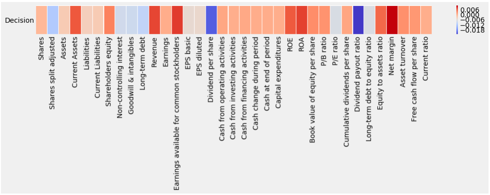
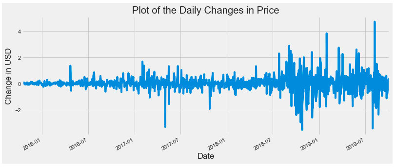
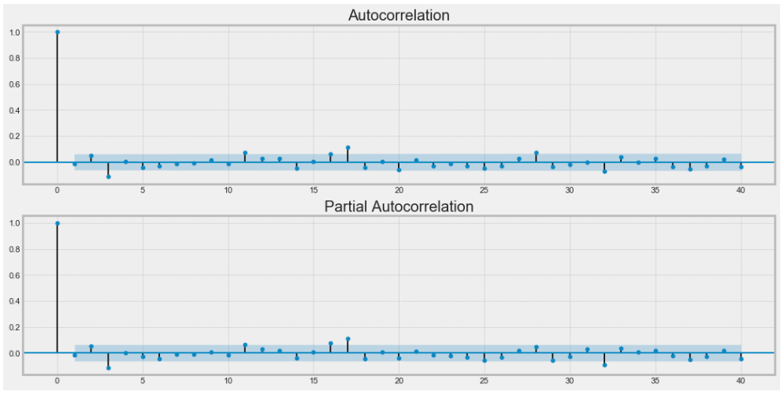
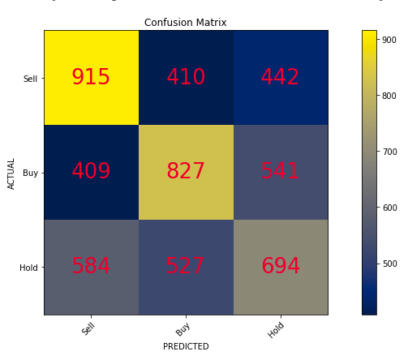
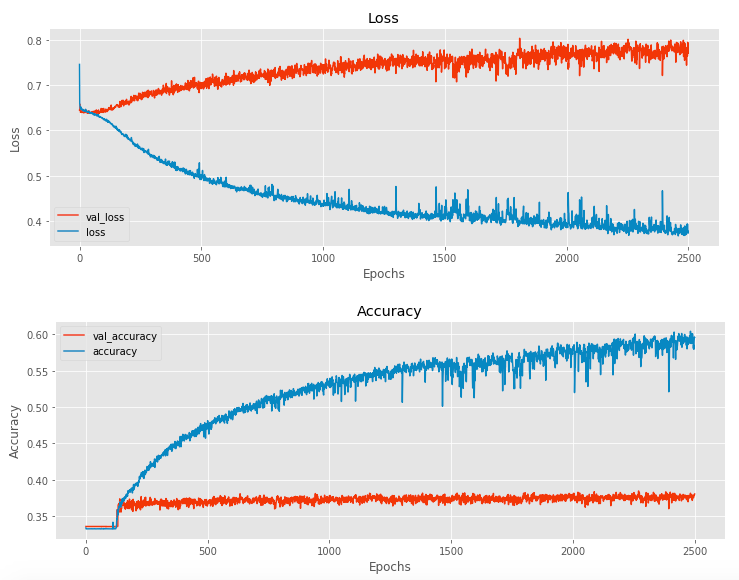

# Stock Analyzer
Replacing technical, fundamental, and sentimental stock analysis with Machine Learning Models

## Table of Contents
- [Project Purpose](#Project-Purpose)
- [Project Overview](#Project-Overview)
- [Data Sources](#Data-Sources)
- [Data Gathering and Cleaning](#Data-Gathering-and-Cleaning)
- [Exploring Data](#Exploring-Data)
- [Classification](#Classification)
- [Time Series](#Time-Series)
- [Sentimental](#Sentimental)
- [Frontend and Presentation](#Frontend-and-Presentation)
- [Next Steps](#Next-Steps)

## Project Purpose
Three of the most popular stock analysis methods are technical, fundamental, and sentimental analysis.  Perhaps Machine Learning can be used to remove the human element from these methods of analysis.  For fundamental analysis, classification models were used to determine if a stock would be a Buy, Sell, or Hold.  For technical analysis, time series models were used to forecast the general direction of the stock price.  For sentiment analysis, NLP tools were used such as NLTK's VADER to determine the public's opinion and feeling towards a stock.  The hope would be that these machine learning models would enhance and improve the current methods of analysis. 

## Project Overview
1. Collected data from three different web sources by using webscraping or API calls.
    - Yahoo Finance for Time Series data
    - Stockpup for Fundamental data
    - Twitter for sentimental data
2. Data cleaning and Exploratory Data Analysis
    - Fundamental data was cleaned and formatted into a Pandas DataFrame.
    - Time series data was downloaded as daily data then resampled into weekly and monthly intervals.
    - Sentimental data was formatted into a Pandas DataFrame.
3. Modeling
    - Fundamental data was then used to train several different classification models.
    - Time series data was fitted and trained to two time series models.
    - Sentimental data did not require any modeling.
4. Presentation and Frontend
    - Streamlit was used to create a frontend for each form of analysis with their respective machine learning models.
5. Next Steps

## Data Sources
Data sources for each different method of stock analysis required different websources:
- **Stockpup.com** contained 765 stock tickers and quarterly reports for each.  This was webscraped using `BeautifulSoup` and stored as separate DataFrames in a dictionary then pickled for later use.

- **Yahoo Finance** contained the daily prices for each stock searched and could be downloaded individually as a CSV file.  `Selenium` was used to automate the downloading process for any stock entered.

- **Twitter** was used to source 200 tweets about any stock desired.  `Twint` was used to simplify the tweet webscraping process instead of Twitter's API due to the API's limited nature.

## Data Gathering and Cleaning
- __BeautifulSoup__ was used to scrape *Stockpup.com*: [Retrieving Data](Classification/Retrieving_Data.ipynb)

- __Selenium__ was used to scrape *Yahoo Finance*: [Price Scraping](Time_Series/Closing_Price_Scraping.ipynb)

- __Twint__ was used to scrape *Twitter*: [Twitter Scraping](Sentiment/Sentiment_Twitter.ipynb)

### Data Cleaning:
__Fundamental Data from Stockpup.com__

[Fundamental Data Cleaning](Classification/Cleaning_Original_Data.ipynb)

_Every Quarterly Report was downloaded as a Pandas DataFrame and stored in a dictionary of DataFrames._

For each DataFrame:
  1. Index was set as datetime from the "Quarter end" column.
  
  2. 'None' values were replaced with 0 and converted to numerical values.
  
  3. Replaced current values with the differences between each Quarter with respect to each Stock.  (Also replaced infinite values with 1 and -1.  Also any new NaNs were replaced once again with 0.
  
  4. Created new columns showing the future Quarter's price high/low % change then created classes based on those values.
    - If the future price high and future price low increased by 5% or more, then the present Quarterly report is classified as a Buy.
    - If the future price low and future price high decreased by 5% or more, the the present Quarter report is classified as a Sell.
    - Otherwise, the present Quarterly report is classified as a Hold.
    
  5. First and Last rows were excluded because the last row has no data to calculate the difference with and the first row has no data showing the future price high and low.
  
  6. All Quarterly Reports were then combined into one DataFrame.
  
  7. Checked for any remaining NaNs.  Columns with less than 500 unique values were excluded because their impact would be small if nothing at all.
  
  8. Resetted Index
  
  9. Classes were balanced by removing excess rows to match the class with least amount of rows.
  
  10. Finally, the final DataFrame was exported as a pickle file for modeling.

__Sentimental Data from Twitter__

[Sentimental Data Cleaning](Sentiment/Sentiment_Twitter.ipynb)

_Twint, a module used for scraping tweets, was used over the Twitter API because of Twint's flexibility and freedom._

  - 200 Tweets were scraped for the sake of brevity in the presentation.  More tweets can be scraped if desired.
  - Twint searched for any stock given based on the cashtag($) (e.g. $AMD).
  - Retweets were filtered out.
  - No media such as pictures or video.
  - English tweets only.
  - No tweets referring to web links.
  - All tweets were then stored into a Pandas DataFrame.

__Technical Data from Yahoo Finance__

[Technical Data Cleaning](Time_Series/Time_Series_Cleaning_and_Exploring.ipynb)

_Not much cleaning was required for the technical data_

  - Each stock had their price data read into a Pandas DataFrame
  - Index was set as a Datetime index from the 'Date' column
  - Values were converted to numerical values.
  - All columns were excluded except for closing price.
  - Data was then resampled into weekly and monthly formats but still retaining daily as well.
  - Last 1000 periods of data was used because they represent the current market climate better than older data.
  - Finally, each DF of resample data was exported into a pickle file.
  
## Exploring Data

[Fundamental Exploration](Classification/Exploring_Data.ipynb)

Visualization of the Class Balance between Buys, Holds, Sells. 

Classes were balanced during the cleaning process.  This is done so that randomly guessing a class label will result in a 33% success rate.

Visualization of the correlations between each feature and the target variable _(Decision)_.

Here the most influential features to the 'Decision' can been seen.

Visualization of the important features.  

Using the ExtraTreesClassifier, the most important features were ranked and plotted.  According to the simple classifier, "P/B Ratio" turned out to be the most important feature when it comes to determining the correct class label.

With the most important features ranked and sorted, the unimportant features were removed from the dataset and the top 10 were kept (along with the top 5 and top 20 features for comparison's sake).

[Technical Exploration](Time_Series/Time_Series_Cleaning_and_Exploring.ipynb)

For exploration of the technical/time series data, the last 1000 periods were used instead of the entire dataset because those 1000 periods better represent the current market climate.  These 1000 periods were derived from the Daily data as well as the Weekly and Monthly.  Weekly and Monthly were resampled Daily Data.

Visualization of the Daily Differences in Price data

Differencing the data was done to check for sationarity.  This step is necessary for any ARMA modeling.

Visualization of the ACF and PACF

The ACF and PACF was done to check for any seasonality with the time series data.

[Sentiment Exploration](Sentiment/Sentiment_Twitter.ipynb)

_Exploration of the Sentiment data was done as the final presentation of sentiment analysis because no modeling was done to the data.  A more in-depth look into the sentiment data is under the Sentimental section of this README._

## Classification

For the fundamental data, classification models were used to determine if a stock was a Buy, Hold, or Sell.  Numerous Classification models were implemented to find the best performing model.  These models are:

    - XGBoost
    - AdaBoost
    - Random Forest
    - SVM
    - KNN
    - Neural Network
    
Out of all these Classification models, XGBoost performed the best:

    - Training Score: 47%
    - Testing Score: 45%
    
XGBoost's confusion matrix

This confusion matrix was created from XGBoost modeling the top 10 features from the original dataset.

_Most of the other models were performing with scores around 35% - 43% range for both their Testing and Training set._

### Feature Selection and Feature Engineering for Classification Features

[Feature Selection and Engineering](Classification/Exploring_Data.ipynb)

Many different approaches to the fundamental features were considered to improve the performance of the models.

These approaches were:

* Feature Interactions
* Principle Component Analysis (PCA)
* Feature Importance
* Scaling the Data

__Feature Interactions__

Through the use of SKlearn's _PolynomialFeatures_ and _StandardScaler_, the features from the original dataset all interacted with each other.  Any feature that involved _Price_ was removed to prevent any data leakage as well as the class labels and self-interacting features.  After removing those features, a little over 700 features still remain.  

__Principle Component Analysis (PCA)__

Because there are a little over 700 features now in the dataset, many features must be removed to simplify the computing process as well as to avoid the "Curse of Dimensionality".  To lessen the amount of features, PCA was utilized, which was able to reduce the number of features from 700+ to 79.

(E.g. [PCA Modeling](Classification/Modeling(Int_feats)-SVM.ipynb))

_After using many different models on the data from the reduced number of features, the training and testing scores did not perform significantly better than the model scores on the non-interacted features._

__Feature Importance__

By using the top 20, top 10, and top 5 most important features derived from the ExtraTreesClassifier, different modeling scores were captured from various models.  This was done to compare the performance of each model under the different number of top features.

(E.g. [Top 20 feature modeling](Classification/Modeling-XGBoost-20.ipynb))

_After modeling each number of important features, the top 10 most important features proved to be the best performing set of features to model._

__Scaling the Data__

Scaling the data using SKlearn's _StandardScaler_ improved model performance over unscaled data.

[Scaled Modeling](Classification/Modeling-KNN.ipynb) vs. [Unscaled Modeling](Classification/Modeling-KNN-unscaled.ipynb)

### Deep Learning Neural Network for Classification

[Neural Network Classification](Classification/NeuralNetwork-Classification-10.ipynb)

To fully explore the classification aspect of the problem, a neural network was attempted with the top 10 features.  A variety of layers, epochs, and nodes were experimented with to find the optimum amount.

After training the neural network for many hours and seeing no significant improvements over the machine learning models, it was concluded that a neural network for this problem was not the best solution.  Many of the other machine learning classification models performed better than the best scored neural network.

## Time Series

Numerous timeseries models were utilized to find the model with the best performance.  These models were:

- FaceBook Prophet
- SARIMAX
- Recurrent Neural Network

## Sentimental

## Frontend and Presentation

## Next Steps
